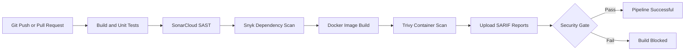

# 🚀 Lean DevSecOps CI/CD Pipeline

[](https://github.com/riyan-ahmed/lean-devsecops-pipeline/actions/workflows/main.yml)

## Shift-Left Security in a Java CI/CD Workflow

A Java-based DevSecOps pipeline that integrates automated security testing into the software delivery lifecycle using GitHub Actions, SonarCloud, Snyk, Trivy and Docker.

---

## 📌 Overview

This project demonstrates how shift-left security can be embedded directly into a CI/CD pipeline.

The objective is not only to automate builds and security scans, but also to evaluate the practical trade-offs between:

- Security coverage
- Pipeline performance
- Vulnerability enforcement
- Developer productivity

The pipeline automatically builds, tests and scans the application whenever code is pushed or a pull request is created.

---

## 🧠 Problem Statement

Traditional CI/CD pipelines often treat security as a late-stage activity. This can:

- Allow vulnerable code and dependencies to progress through the delivery process
- Increase the cost of remediation
- Delay releases when vulnerabilities are discovered late
- Reduce visibility into software supply-chain risks

This project addresses that problem by embedding security checks directly into the CI workflow.

---

## 🏗️ Pipeline Architecture



### Pipeline flow

1. Code is pushed to GitHub
2. GitHub Actions starts the workflow
3. Maven builds and tests the application
4. SonarCloud performs static code analysis
5. Snyk scans third-party dependencies
6. Docker builds the application image
7. Trivy scans the container image
8. SARIF reports are uploaded to GitHub Code Scanning
9. The pipeline blocks high and critical security findings

The workflow runs on:

- Pushes to `main`
- Pull requests targeting `main`
- Manual workflow execution

---

## 🔐 Security Layers

| Security layer | Tool | Purpose |
|---|---|---|
| Source code | SonarCloud | Detects bugs, vulnerabilities and insecure coding patterns |
| Dependencies | Snyk | Identifies vulnerable direct and transitive dependencies |
| Container image | Trivy | Scans application libraries and operating-system packages |
| Quality gate | SonarCloud | Blocks the pipeline when quality requirements are not met |
| Security gate | GitHub Actions | Blocks high and critical Snyk or Trivy findings |
| Reporting | GitHub Code Scanning | Provides centralised SARIF-based security visibility |

---

## ⚙️ Technology Stack

- **CI/CD:** GitHub Actions
- **Application:** Java and Spring Boot
- **Build tool:** Maven
- **Static analysis:** SonarCloud
- **Dependency scanning:** Snyk
- **Container scanning:** Trivy
- **Containerisation:** Docker
- **Reporting:** SARIF and GitHub Code Scanning

---

## 🧪 Key Features

- ✅ Automated Maven build and unit testing
- ✅ SonarCloud static application security testing
- ✅ SonarCloud Quality Gate enforcement
- ✅ Snyk software composition analysis
- ✅ Docker multi-stage build
- ✅ Non-root container execution
- ✅ Container health checks
- ✅ Trivy container vulnerability scanning
- ✅ SARIF report uploads to GitHub Security
- ✅ High and critical vulnerability enforcement
- ✅ Reproducible and manually executable workflows

---

## 🛡️ Vulnerability Detection and Remediation

The security gates initially blocked the pipeline after Snyk and Trivy detected vulnerable libraries in the application dependency tree and packaged Docker image.

### Remediation completed

| Component | Previous version | Patched version |
|---|---:|---:|
| Spring Boot | `3.3.0` | `3.5.15` |
| Spring Framework | `6.1.8` | `6.2.19` |
| Logback | `1.5.6` / `1.5.34` | `1.5.36` |
| Jackson | `2.17.1` / `2.21.4` | `2.21.5` |
| Apache Tomcat | `10.1.24` / `10.1.55` | `10.1.56` |
| Micrometer | `1.13.0` | `1.15.12` |

After remediation, the complete pipeline passed successfully with no remaining high or critical findings.

This demonstrates the full DevSecOps feedback cycle:

> **Detect → Block → Remediate → Verify**

---

## 📊 Key Learnings and Trade-Offs

### Dependency risk

Most blocking vulnerabilities originated from transitive dependencies packaged inside the application rather than from custom application code.

### Security versus speed

Security scanning increased the total pipeline runtime, but the additional execution time remained acceptable for continuous integration.

### Reporting versus enforcement

Generating a report alone does not prevent insecure software from progressing. Snyk and Trivy were therefore configured to upload reports before enforcing the final security gate.

### Risk-based enforcement

The pipeline blocks high and critical findings while still reporting lower-severity issues for review. This provides a practical balance between security and delivery speed.

### Continuous maintenance

A green pipeline is not permanently secure. New vulnerabilities may be disclosed after dependencies have already been released, making continuous scanning and dependency updates essential.

---

## 📁 Repository Structure

```text
.
├── .github/
│   └── workflows/
│       └── main.yml
├── src/
│   ├── main/
│   └── test/
├── .mvn/
├── Dockerfile
├── mvnw
├── mvnw.cmd
├── pom.xml
└── README.md
```

---

## ▶️ Run Locally

### Prerequisites

- Java 17 or later
- Docker
- Git

### Build and test

```bash
./mvnw clean verify
```

### Build the Docker image

```bash
docker build -t lean-devsecops-pipeline:local .
```

### Run the container

```bash
docker run --rm -p 8081:8080 lean-devsecops-pipeline:local
```

### Check application health

```bash
curl http://localhost:8081/actuator/health
```

Expected response:

```json
{"status":"UP"}
```

---

## 🔎 Security Reports

Security results are available in:

- **GitHub Actions:** workflow execution logs and downloadable artifacts
- **GitHub Security:** Code scanning alerts uploaded using SARIF
- **SonarCloud:** static analysis and Quality Gate results
- **Snyk:** dependency vulnerability results
- **Trivy:** container image vulnerability results

---

## 🎓 Academic Context

This repository supports the MSc Advanced Computer Science final project:

**“An Analytical Case Study of Shift-Left Security: Evaluating the Practical Trade-Offs of Integrating Open-Source Security Tools into a Java CI/CD Pipeline.”**

---

## 🎯 Why This Project Matters

This project demonstrates more than individual security tools. It shows:

- Practical CI/CD pipeline design
- Security embedded early in development
- Layered application and container scanning
- Automated vulnerability enforcement
- Evidence-based dependency remediation
- Centralised security reporting
- A realistic balance between security and delivery speed

---

## 📬 Contact

**Riyan Ahmed**

- [GitHub](https://github.com/riyan-ahmed)
- [LinkedIn](https://www.linkedin.com/in/riyan-ahmed-devops)
